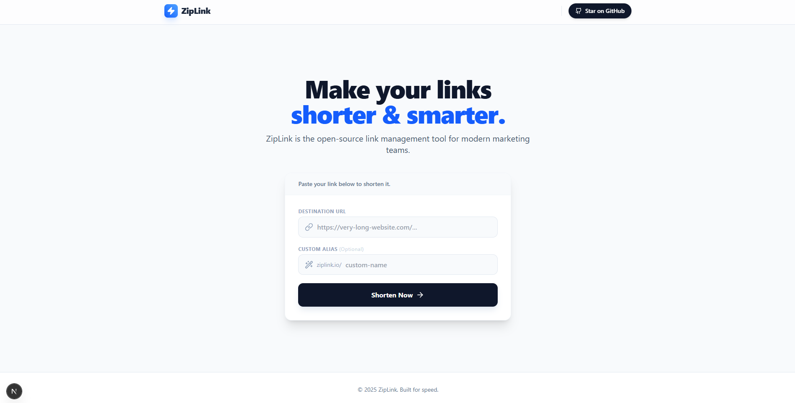

# ⚡ ZipLink - Shorten URLs in a Zip


ZipLink is a modern, privacy-focused URL shortening infrastructure designed for speed and simplicity. It allows users to create custom short links, generate QR codes, and track real-time analytics without requiring any login.

**[🚀 View Live Demo](https://zip-link-maruthu04.vercel.app)** · **[🐛 Report Bug](https://github.com/maruthu04/zip-link/issues)**

---

## 🌟 Key Features

* **⚡ Instant Shortening:**
    * Generate random short links (e.g., `ziplink.io/AbC12`) in milliseconds.
    * Create **Custom Aliases** (e.g., `ziplink.io/my-brand`) for better branding.
* **📊 Public Analytics:**
    * No login required.
    * "Open Link" button to test redirects instantly.
* **📱 Integrated Tools:**
    * One-click **QR Code Generation** for every link.
    * Responsive design for mobile and desktop users.
* **🛡️ Privacy & Hygiene:**
    * **Auto-Expiry (TTL):** Links automatically self-destruct after 7 days to keep the database clean.
    * Robust URL validation using Regex.
* **🚀 High Performance:**
    * Built on **Next.js 15** (App Router) for server-side rendering and speed.
    * Styled with **Tailwind CSS** for a glassmorphism look.

---

## 🛠️ Tech Stack

**Frontend:**
* [Next.js 15](https://nextjs.org/) (React Framework)
* [Tailwind CSS](https://tailwindcss.com/) (Styling)
* [Lucide React](https://lucide.dev/) (Icons)

**Backend:**
* [Next.js Server Actions](https://nextjs.org/docs/app/building-your-application/data-fetching/server-actions-and-mutations) (API Logic)
* [MongoDB](https://www.mongodb.com/) (Database)
* [Mongoose](https://mongoosejs.com/) (ODM)

---

## 🚀 Getting Started

Follow these steps to run the project locally.

### Prerequisites
* Node.js (v18 or higher)
* MongoDB Atlas Account or Local Instance

### Installation

1.  **Clone the repository**
    ```bash
    git clone [https://github.com/maruthu04/zip-link.git](https://github.com/maruthu04/zip-link.git)
    cd zip-link
    ```

2.  **Install dependencies**
    ```bash
    npm install
    ```

3.  **Configure Environment Variables**
    Create a `.env.local` file in the root directory and add the following:

    ```env
    # Database Connection
    MONGODB_URI=mongodb+srv://<username>:<password>@cluster0.example.net/ziplink

    # App Base URL (For generating full links)
    NEXT_PUBLIC_BASE_URL=http://localhost:3000
    ```

4.  **Run the application**
    ```bash
    npm run dev
    ```

    Open [http://localhost:3000](http://localhost:3000) with your browser to see the result.

---

## 📸 Screenshots

| Dashboard View |
|:---:|
|  |

---

## 🤝 Contributing

Contributions are what make the open source community such an amazing place to learn, inspire, and create. Any contributions you make are **greatly appreciated**.

1.  Fork the Project
2.  Create your Feature Branch (`git checkout -b feature/AmazingFeature`)
3.  Commit your Changes (`git commit -m 'Add some AmazingFeature'`)
4.  Push to the Branch (`git push origin feature/AmazingFeature`)
5.  Open a Pull Request

---

## 📜 License

Distributed under the MIT License. See `LICENSE` for more information.

---


Project Link: [https://github.com/maruthu04/zip-link](https://github.com/maruthu04/zip-link)